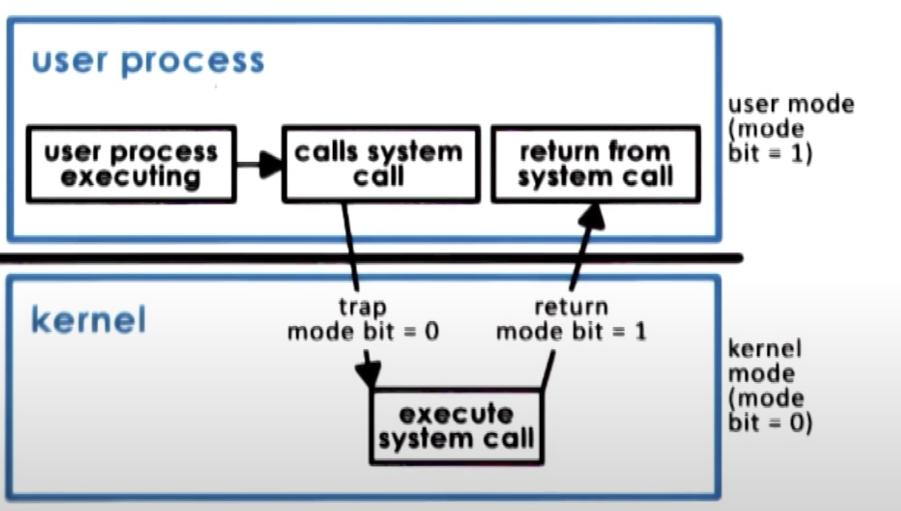

# System Call Flowchart

1. The user-process starts executing
2. Process makes a system call
   - generates a `trap`
   - sets `mode bit = 0`
   - require some privileged operation to be performed
3. The control is passed to the operating system
   - privileged mode
   - involves changing the execution context
     - from the user process
     - to the os kernel
   - the operating system will perform the operation
     - execute the instruction in the os code that corresponds to the system call
   - return result to the process
   - sets `mode bit = 1`
4. Control comes back to the calling process
   - involves changing the execution context
     - from the os kernel
     - to the user process

- Not a cheap operation
- To make a system call, an application must
  - write arguments
  - save relevant data at well-defined location
  - make the actual system call
- The arguments can be

  - passed directly between the user program and os kernel
  - can be passed indirectly by specifying their address

- A System call can be
  - Synchronous
    - Process waits until the system call completes
  - Asynchronous
