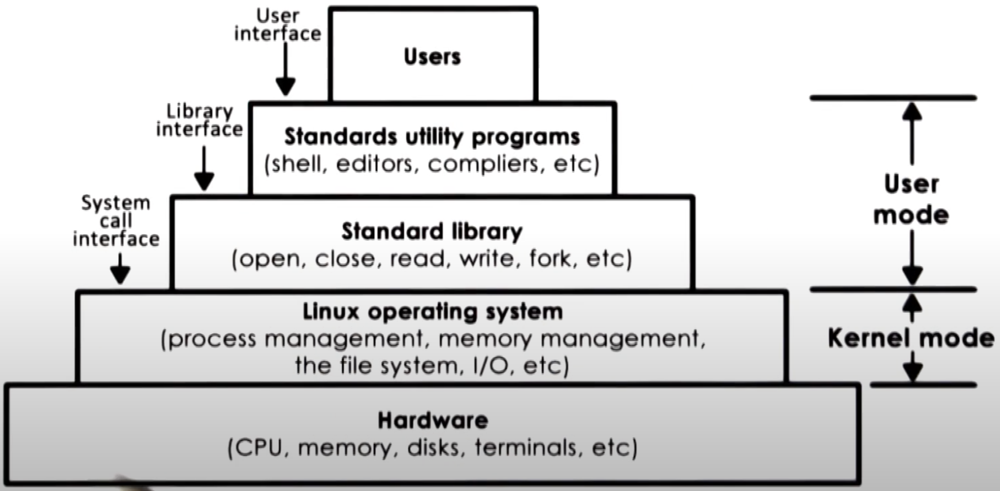
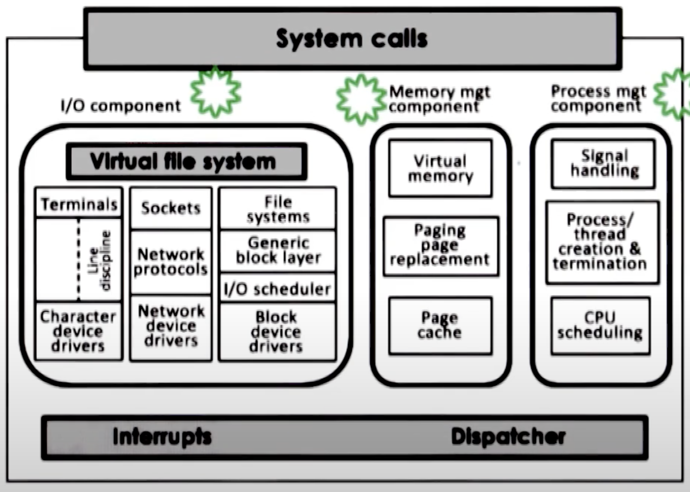

# Linux Architecture

- At the bottom is the hardware
- Linux kernel abstracts and manages the hardware
  - supports a number of abstractions and associated mechanisms
- On top of that are standard libraries
  - implements the system call interfaces
- On top of that are utility programs
  - for users to easily interact with the operating system
- At very top is the user developed applications

- OS Kernel consists of several logical components
  - IO Management
  - Memory Management
  - Process Management
- All the components have well defined functionalities and interfaces
- Each components can be individually modified or replaced
