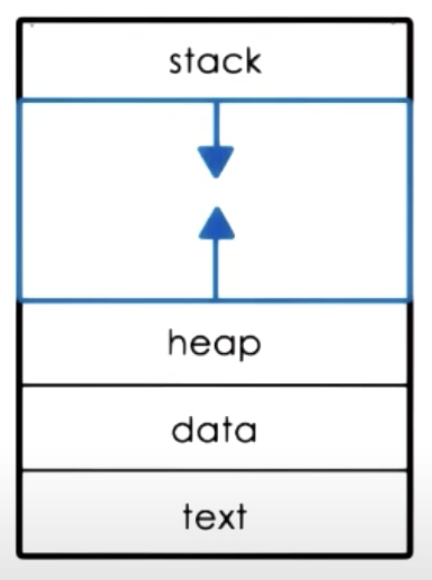

# What Does a Process Look Like?

- A Process encapsulates all the data for running applications
  - the code
  - the variables/data
- Every element of the _process state_
  - needs to be uniquely identified by its address

## Address Space

- It is an OS abstraction
- It is used to encapsulate all of the process state
- It is defined by a range of address
  - from `V0` to `Vmax`
  - different types of process state will appear in different regions in the address space
- There are different types of state
  - _text and data_
    - static state
    - available when process first loads
  - _heap_
    - dynamically created during execution
    - There can be holes in the region of address space - not contiguous
  - _stack_
    - also dynamic part of space
      - grows and shrinks
    - Operates as _LIFO_ queue
      - Last-in-First-out
    - used to
      - save process state while calling other procedures
      - restore saved state while returning
