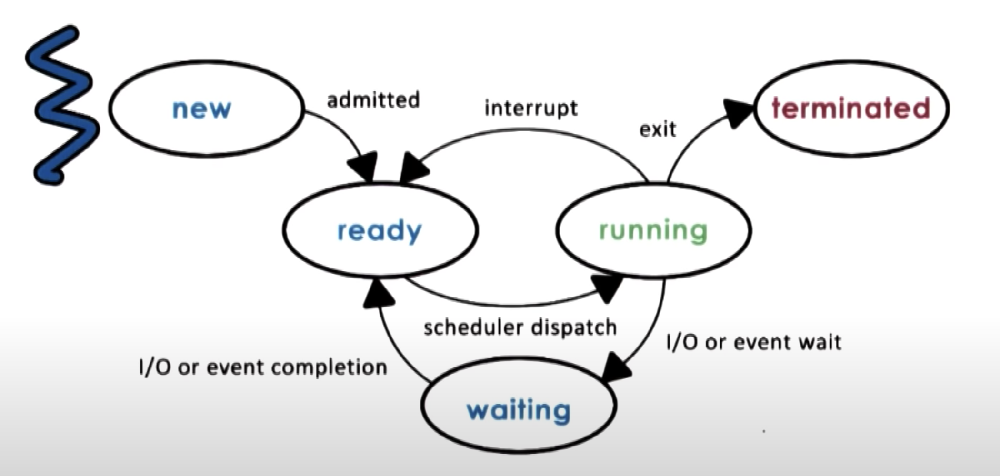

# Process Life Cycle: States

- _RUNNING_ state
  - enters when process from _READY_ state is scheduled
  - process can be interrupted
    - context switched
    - becomes idle
      - moves back _READY_ state
  - process may need
    - to initiate some operation
      - reading data from disk
      - wait on some event like timer or user input
    - enters the _WAITING_ state
  - process may finish all operations or encounters some ERROR
    - will exit
    - return the appropriate exit code
      - SUCCESS
      - ERROR
    - process is _TERMINATED_
- _READY_ state
  - it is ready to execute
  - not currently executing on CPU
  - wait in this state until the scheduler is ready
  - The Scheduler would schedule the process again, later
    - move to _RUNNING_ state
- _NEW_ state
  - initial state
  - admitted to it on creation
  - OS performs admission control here
  - If process is OK
    - OS allocates and initialises a Process Control Block
    - also allocates some initial resources
- _WAITING_ state
  - enters when process needs to do some longer operation
  - when the event occurs
    - the process will become _READY_ again
