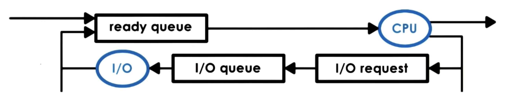

# What about I/O?

- When a process makes an IO request
  - The operating system delivers the request
  - and places the process on the IO queue
    - that's associated with that particular IO device
  - Process then waits in the IO queue
  - Process will wait
    - till the devide completes the IO operation
    - responds to the particular request
  - On receiving the response from IO device
    - process is ready to be scheduled on the CPU
    - and hence moves to the ready queue

- A process can reach the ready queue in a number of ways
  - process waiting on an IO event
    - finds its way to ready queue on completion of the IO request
  - process running on CPU
    - time slice expired
    - context switched
    - moved to ready queue
  - new process created via fork call goes to ready queue
  - process waiting for an interrupt
    - once the interrupt occurs
    - goes back to the ready queue
