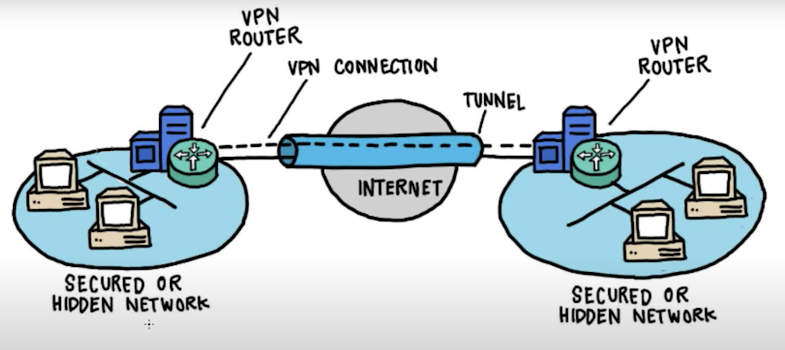
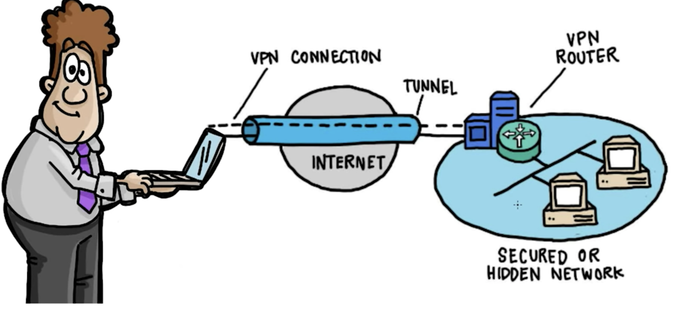

# Understanding VPNs

- _VPNs_ are _Virtual Private Networks_
- It is a way to connect to a private network

## Site to Site VPN

- It connects two private hosted networks
- The networks could be seperated by internet over long distances
- The VPN sets up a tunnel between the gateway routers or hosts in the networks
  - The tunnel is a layer of encryption
  - Inside the encrypted tunnel, a route is set
  - The router only sees the tunnel route as a standard route
  - Using the route, any computer can send/receive the information from the other side
- The traffic inside the tunnel is not visible to the internet

## End User VPN

- It is used by end-users to connect to office networks
- The computer establishes same type of tunnel
  - Once the tunnel is set
  - the computer is connected to the internal network remotely

## VPN Protocols

- OpenVPN
- SSH
- L2TP
- IPSec
